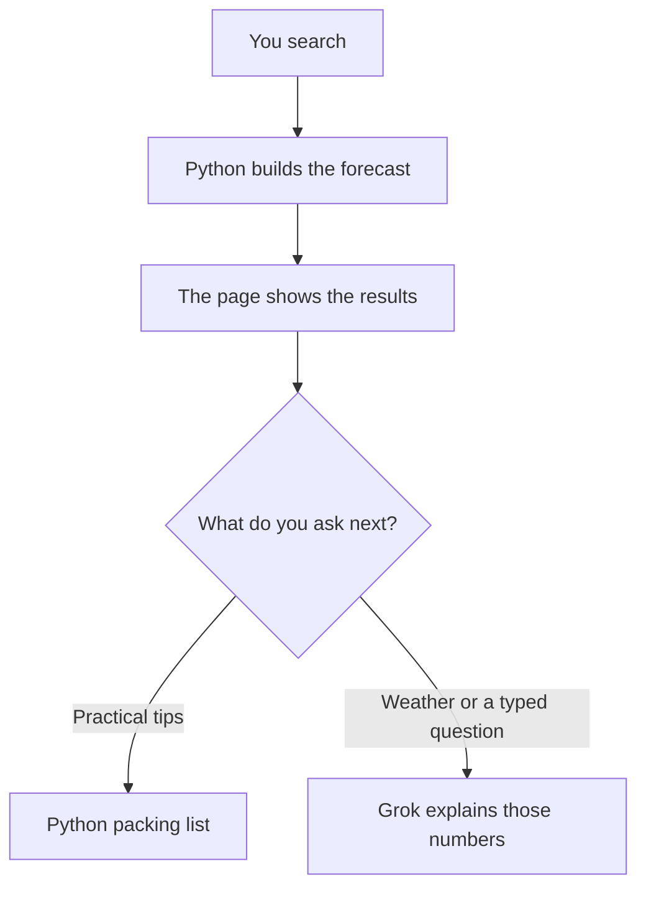

# How the agent works

Python looks up weather, showers, or maps.  Then the agent reads a system message that already contains the numbers, then writes a short reply.

The model is **grok-3-mini** via the OpenAI-compatible xAI API (`ai/agent.py`).

## Rule

`ai/tools.py` calculates. `ai/agent.py` only talks. 

## End-to-end flow

1. You pick a city, a date, and where you will watch from.
2. Python builds the forecast and the page shows it.
3. If you click **Practical tips**, Python writes the packing list.
4. If you ask about cold, wind, rain, or type a question, Grok answers using the numbers already on the page.



## When Grok is called

A successful search builds `st.session_state["messages"]`:

1. **system** — `SYSTEM_PROMPT` plus `format_results_context(results)`
2. **assistant** — the greeting (“The sky is booked…”)

A button or `st.chat_input` stores text in `pending_chat`, then Streamlit reruns. On that rerun:

- The user line is appended.
- If the text is exactly `Practical tips for a memorable night`, Python builds the packing list (`format_tips_for_results`): your place, then Near you when that card exists.
- Otherwise `agent(messages)` is called with the **whole** history (system + greeting + earlier turns + new question).

## Tools (Python, not Grok)

These run inside `run_pipeline` **before** chat exists. Grok cannot call them.

| Function | File | What it does |
| --- | --- | --- |
| `geocode_city` | `utils.py` | Open-Meteo place lookup |
| `apply_city_part_offset` | `utils.py` | ~10 km N/E/S/W in big cities |
| `fetch_weather` | `tools.py` | 14-day hourly forecast |
| `load_showers` / `find_active_shower` | `meteor_schema.py` | Catalog match |
| `evaluate_all_nights` | `tools.py` | Night hours, rates, best window |
| `add_scores` | `tools.py` | 0–100 vs the 14-day peak |
| `two_other_nights` | `tools.py` | Next-best nights, same place |
| `nearby_better_date` / `closest_shower_date` | `tools.py` | Extra date hints |
| `find_nearby_dark_sites` | `utils.py` | OSM / Nominatim darker places |
| `nearby_place_forecasts` | `tools.py` | Near you + other sides of town |
| `comfort_conditions` | `tools.py` | Temp, wind, rain, humidity, dress hint for the user's window |
| `comfort_for_nearby_place` | `tools.py` | Same, from a separate Open-Meteo download at the Near you pin |

`agent()` only creates an xAI client and sends `messages`. If `XAI_API_KEY` is missing, it returns a short error and the forecast on the page still stands.

## Prompts

All of this text lives in `ai/prompts.py`.

### What Grok is told (`SYSTEM_PROMPT`)

Grok is a friendly helper for watching shooting stars. It must:

1. Talk only about extra help: temperature, wind, rain, humidity, what to wear, and practical tips.
2. If **NEAR YOU** exists, answer in two parts: **YOUR PLACE** then **NEAR YOU**, using the matching WINDOW CONDITIONS / PRACTICAL TIPS. Do not mix them.
3. If someone asks for practical tips, use those PRACTICAL TIPS blocks as written.
4. Keep weather answers short (about 2 to 4 sentences per place).
5. A **NATURE NOTE** means sitting in a park often *feels* colder and damper; Grok must not invent different °C.

### Practical tips (`format_practical_tips`)

Python writes the packing list from the weather in the viewing window (how cold it is, rain, wind, damp grass, insects). If Near you exists, there are two lists (your place, then that park, with a nature feel note for reserves and forests).

- The **Practical tips** button shows this on the page.
- The same lists are copied into Grok’s context, so a typed “practical tips” question can match the button.
- If there is no weather block, `PRACTICAL_TIPS_FALLBACK` is used instead.

## Context packed into the system message

`format_results_context(results)` is plain text Grok can quote. It is **not** a second API for live data.

Typical blocks:

| Block | Content |
| --- | --- |
| Identity | City entered, resolved location, timezone, date, sky quality, big-city flag, city part |
| Shower | Active shower or none |
| Main forecast | Best window, meteor range, score, score explanation |
| TWO OTHER NIGHTS | Date, shower, window, meteors, score |
| Nearby better date | Only if a shower is active and another night scores higher |
| Closest date with a shower | Only if the chosen night has no major shower |
| NEAR YOU | Named place, kind, distance, side, window, meteors, map URL |
| OTHER SIDES OF THE CITY | Same shape, one place per side, not the user’s side |
| WINDOW CONDITIONS AT YOUR PLACE | Temp min/max °C, wind, rain, humidity, cloud, dress hint for the user's window |
| PRACTICAL TIPS AT YOUR PLACE | Packing list for the user's pin |
| WINDOW CONDITIONS AT NEAR YOU | Same weather fields from the park's own forecast |
| NATURE NOTE | Optional: grass often feels colder/damper than the street |
| PRACTICAL TIPS AT NEAR YOU | Packing list for that park |

WINDOW CONDITIONS AT YOUR PLACE come from the **same hourly rows** as the suggested viewing time at the user's pin. WINDOW CONDITIONS AT NEAR YOU come from a **second** Open-Meteo download at that park.

## Message list sent to Grok

```
[
  { role: system,     content: SYSTEM_PROMPT + "\n\n" + context },
  { role: assistant,  content: greeting },
  { role: user,       content: "Will it be windy during the viewing window?" },
  { role: assistant,  content: previous reply, if any },
  ...
]
```

Grok never receives raw weather DataFrames or `showers.json`. It only sees this text.

## Suggested chat buttons

| Button | What happens |
| --- | --- |
| How cold? What to wear? | Sent to Grok; should cover YOUR PLACE then NEAR YOU |
| Will it be windy? | Sent to Grok |
| Will it rain? | Sent to Grok |
| Practical tips for a memorable night | Python packing list(s) |

Typed questions in the chat box go to Grok, except the exact practical-tips sentence above.

## Related doc

Folder layout and calculation path: [APP_STRUCTURE.md](APP_STRUCTURE.md).
