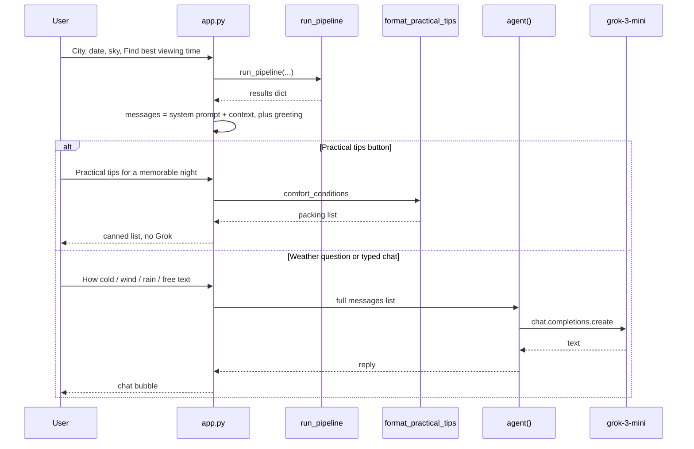

# How the agent works

Grok does **not** look up weather, showers, or maps. Python does that first. The agent only reads a system message that already contains the numbers, then writes a short English reply.

The model is **grok-3-mini** via the OpenAI-compatible xAI API (`ai/agent.py`).

## Rule

`ai/tools.py` calculates. `ai/agent.py` only talks. There is no Grok tool-calling.

## End-to-end flow



## When Grok is called

A successful search builds `st.session_state["messages"]`:

1. **system** — `SYSTEM_PROMPT` plus `format_results_context(results)`
2. **assistant** — the greeting (“The sky is booked…”)

A button or `st.chat_input` stores text in `pending_chat`, then Streamlit reruns. On that rerun:

- The user line is appended.
- If the text is exactly `Practical tips for a memorable night`, Python builds the packing list from `comfort_conditions` (`format_practical_tips`). Grok is skipped.
- Otherwise `agent(messages)` is called with the **whole** history (system + greeting + earlier turns + new question).

The system message is not shown in the chat UI.

## Tools (Python, not Grok)

These run inside `run_pipeline` **before** chat exists. Grok cannot call them.

| Function | File | What it does |
| --- | --- | --- |
| `geocode_city` | `utils.py` | Open-Meteo place lookup |
| `apply_city_part_offset` | `utils.py` | ~10 km N/E/S/W in big cities |
| `fetch_weather` | `tools.py` | 14-day hourly forecast |
| `load_showers` / `find_active_shower` | `meteor_schema.py` | Catalog match |
| `evaluate_all_nights` | `tools.py` | Night hours, rates, best window |
| `add_scores` | `tools.py` | 0–100 vs the 14-day peak |
| `two_other_nights` | `tools.py` | Next-best nights, same place |
| `nearby_better_date` / `closest_shower_date` | `tools.py` | Extra date hints |
| `find_nearby_dark_sites` | `utils.py` | OSM / Nominatim darker places |
| `nearby_place_forecasts` | `tools.py` | Near you + other sides of town |
| `comfort_conditions` | `tools.py` | Temp, wind, rain, humidity, dress hint for the window |

`agent()` only creates an xAI client and sends `messages`. If `XAI_API_KEY` is missing, it returns a short error and the forecast on the page still stands.

## Prompts

All prompt text lives in `ai/prompts.py`.

### System prompt (`SYSTEM_PROMPT`)

Tells Grok it is a friendly English helper, then:

- Do not repeat the forecast, times, other nights, or other places.
- Do not suggest another date, time, or location.
- Extra help only: temperature, wind, rain, humidity, what to wear, practical tips.
- Use **WINDOW CONDITIONS** for weather; never invent numbers.
- If they ask for practical tips, use **PRACTICAL TIPS FOR A MEMORABLE NIGHT** exactly.
- Weather answers: usually 2–4 short sentences.

### Practical tips (Python)

`format_practical_tips(comfort)` builds the packing list from the viewing-window weather (cold vs mild, rain, wind, damp grass, insects). The same text is copied into Grok’s context so a typed “practical tips” question can match the button.

If there is no comfort block, `PRACTICAL_TIPS_FALLBACK` is used.

## Context packed into the system message

`format_results_context(results)` is plain text Grok can quote. It is **not** a second API for live data.

Typical blocks:

| Block | Content |
| --- | --- |
| Identity | City entered, resolved location, timezone, date, sky quality, big-city flag, city part |
| Shower | Active shower or none |
| Main forecast | Best window, meteor range, score, score explanation |
| TWO OTHER NIGHTS | Date, shower, window, meteors, score |
| Nearby better date | Only if a shower is active and another night scores higher |
| Closest date with a shower | Only if the chosen night has no major shower |
| NEAR YOU | Named place, kind, distance, side, window, meteors, map URL |
| OTHER SIDES OF THE CITY | Same shape, one place per side, not the user’s side |
| WINDOW CONDITIONS | Temp min/max °C, wind km/h, rain mm, humidity %, cloud %, dress hint |
| PRACTICAL TIPS FOR A MEMORABLE NIGHT | The weather-aware packing list |

WINDOW CONDITIONS come from the **same hourly rows** as the suggested viewing time, not a daily average.

## Message list sent to Grok

```
[
  { role: system,     content: SYSTEM_PROMPT + "\n\n" + context },
  { role: assistant,  content: greeting },
  { role: user,       content: "Will it be windy during the viewing window?" },
  { role: assistant,  content: previous reply, if any },
  ...
]
```

Grok never receives raw weather DataFrames or `showers.json`. It only sees this text.

## Suggested chat buttons

| Button | What happens |
| --- | --- |
| How cold? What to wear? | Sent to Grok; should use WINDOW CONDITIONS |
| Will it be windy? | Sent to Grok |
| Will it rain? | Sent to Grok |
| Practical tips for a memorable night | Python packing list, no Grok |

Typed questions in the chat box go to Grok, except the exact practical-tips sentence above.

## What Grok must not do

- Invent temperatures, wind, rain, or meteor counts
- Repeat the results tables
- Offer another night or another place (those are already on the page)

The forecast still works without an API key. Only chat needs `XAI_API_KEY`.

## Related doc

Folder layout and calculation path: [APP_STRUCTURE.md](APP_STRUCTURE.md).
