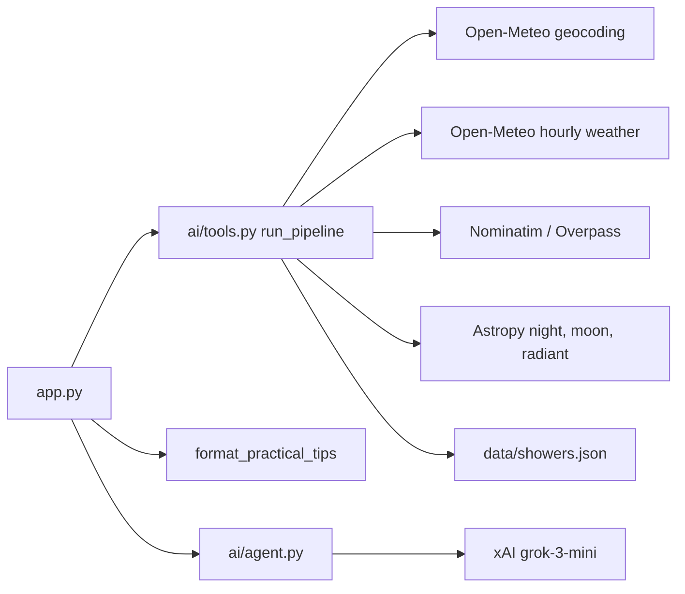

# App structure

Shooting Stars Bot is a Streamlit app. Python calculates the meteor forecast. Grok only explains numbers that Python already computed.

Run it with `streamlit run app.py`.

## Layout on disk

```
shooting-stars-app/
  app.py                      Streamlit UI: form, results, chat
  requirements.txt
  .streamlit/config.toml      Default navy/gold theme
  .streamlit/secrets.toml.example  Sample XAI_API_KEY for local secrets
  data/showers.json           Local meteor-shower catalog
  ai/
    __init__.py
    tools.py                  Weather, astronomy, scores, nearby places
    utils.py                  Geocoding, sky labels, city sides, OSM sites
    meteor_schema.py          Load and match showers
    prompts.py                System prompt, Grok context, practical tips
    agent.py                  One call to grok-3-mini
    theme.py                  Starry CSS and chat avatars
```

Local secrets live in `.streamlit/secrets.toml` (gitignored). Streamlit Cloud uses the same TOML in the Secrets dashboard. The app reads them with `st.secrets`.

## What the user sees

1. **Title** — starry theme and a short welcome.
2. **Form** — city, preferred date (next 14 days), sky quality, optional city side (big cities only).
3. **Viewing forecast** — location, date, shower, best window, meteor range, score.
4. **Two other nights** — next-best nights at the same place.
5. **Near you** — a darker named place within a short drive.
6. **Other sides of the city** — big cities only; skips the side already picked.
7. **Chat** — clothing, wind, rain, and practical tips. Dates and places stay on the page.

## Who does what



| Piece | Role |
| --- | --- |
| `app.py` | Page, session state, errors, chat buttons |
| `run_pipeline` | All science for one search |
| `ai/utils.py` | City lookup, sky quality, N/E/S/W offset, dark-site search |
| `ai/meteor_schema.py` | Which shower is active on a date |
| `ai/prompts.py` | What Grok may say; packing list from weather |
| `ai/agent.py` | Chat completion only — no tools |
| `ai/theme.py` | Look and chat avatars |

## Session state

After a successful search, Streamlit keeps:

- `results` — the `run_pipeline` dictionary
- `messages` — chat history, starting with a **system** message (prompt + context) and a greeting
- `pending_chat` — text from a button or the chat box; processed on the next rerun so the expander stays open

## Calculation path (`run_pipeline`)

1. Geocode the city. Fail with `city_not_found` if needed.
2. If population ≥ 200,000, treat it as a big city and optionally shift ~10 km N/E/S/W.
3. Fetch 14 days of hourly weather at that point. Fail with `weather_timeout` if needed.
4. For each night, keep only astronomical night (Sun below −18°).
5. Match an active shower from `data/showers.json`.
6. Estimate visible meteors per hour, pick the best 1–3 hour block, score 0–100 vs the other 13 nights.
7. Recommend two other nights, a close darker place, and (big city) other sides of town.
8. Slice temperature, wind, rain, and humidity for the viewing window (`comfort_conditions`).

Sky quality sets limiting magnitude (brighter sky → fewer meteors):

- Countryside → Bortle 2
- Village or suburb → Bortle 4
- Residential street → Bortle 6
- City centre → Bortle 8

Nearby “forests” that are tiny urban plantings (for example Tiny Forest) are skipped. City parks are not treated as countryside-dark.

## External services

| Service | Used for |
| --- | --- |
| Open-Meteo geocoding | City → lat/lon, timezone, population |
| Open-Meteo forecast | Hourly cloud, visibility, temperature, wind, rain, humidity |
| OpenStreetMap Nominatim / Overpass | Named reserves, parks, forests, villages |
| xAI (`https://api.x.ai/v1`) | Chat only |

There is no database.

## Related doc

How chat, prompts, and context work: [AGENT.md](AGENT.md).
